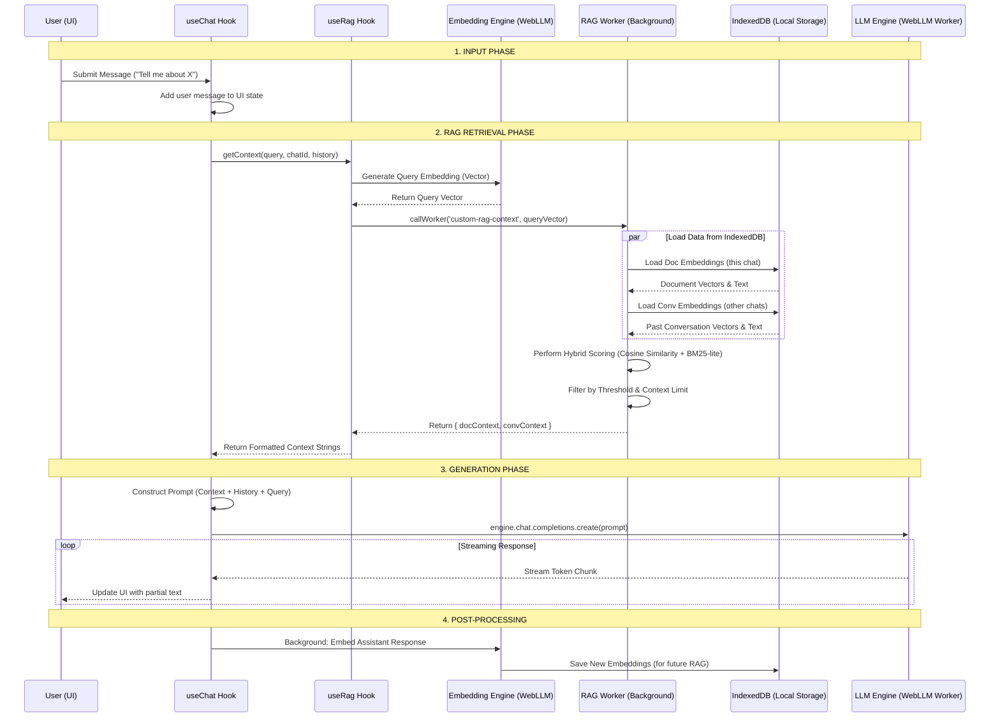

# local.ai

A privacy-first, fully local AI chat application that runs entirely in your browser. No data ever leaves your machine.

## 🚀 Features

- **100% Local Inference**: Powered by WebLLM and WebGPU. All processing happens on your hardware.
- **Privacy by Design**: No servers, no tracking, and no data collection. All chats and documents stay in your browser's IndexedDB.
- **Advanced RAG (Retrieval-Augmented Generation)**:
  - **Document Intelligence**: Upload PDFs and text files to chat with your documents.
  - **Conversation Memory**: Automatically indexes past conversations for context-aware responses across different chat sessions.
  - **Hybrid Search**: Combines vector similarity (embeddings) with keyword matching for highly relevant context retrieval.
- **Multimodal Support**: Attach images to your chats (model dependent).
- **Fast & Responsive**: Utilizes Web Workers for background indexing and similarity search to keep the UI smooth.
- **Customizable**: Choose from various open-source models (Llama 3, Phi-3, etc.) and personalize the UI with accent color presets.
- **Modern UI**: A clean, responsive interface built with Tailwind CSS and Lucide icons.

## 🛠️ Technical Stack

- **Framework**: [Next.js 16](https://nextjs.org/)
- **AI Engine**: [@mlc-ai/web-llm](https://webllm.mlc.ai/) for local LLM execution.
- **Storage**: [IndexedDB](https://developer.mozilla.org/en-US/docs/Web/API/IndexedDB_API) for persistent storage of chats, documents, and embeddings.
- **Embeddings**: Local vector generation for RAG using high-performance embedding models.
- **Vector Search**: Custom hybrid scoring (Cosine Similarity + BM25-lite) implemented in Web Workers.
- **Styling**: [Tailwind CSS 4](https://tailwindcss.com/)
- **Icons**: [Lucide React](https://lucide.dev/)

## 🏁 Getting Started

### Prerequisites

- A WebGPU-compatible browser (latest Chrome, Edge, or Arc).
- Sufficient local storage and a decent GPU for optimal performance.

### Installation

1. Clone the repository:
   ```bash
   git clone https://github.com/yourusername/local.ai.git
   cd local.ai
   ```

2. Install dependencies:
   ```bash
   bun install
   # or
   npm install
   ```

3. Start the development server:
   ```bash
   bun dev
   # or
   npm run dev
   ```

4. Open [http://localhost:3000](http://localhost:3000) in your browser.

## 📖 How it Works

1. **Model Loading**: On first run, the app downloads the selected LLM weights and caches them in your browser's cache. Subsequent loads are near-instant.
2. **Indexing**: When you upload a document or send a message, the text is chunked and converted into high-dimensional vectors (embeddings).
3. **Retrieval**: When you ask a question, the app searches both your current document and past conversations for relevant context.
4. **Generation**: The retrieved context is injected into the prompt, and the LLM generates a response locally on your GPU.

### Message & RAG Lifecycle

The following diagram illustrates how a message travels through the system, integrating with the local RAG pipeline:



**Step-by-Step Breakdown:**

*   **Input Phase**: User input is immediately added to the UI state for responsiveness.
*   **RAG Retrieval**: 
    *   The `useRag` hook generates a vector for the query using a local embedding model.
    *   A dedicated **Web Worker** fetches all stored embeddings from **IndexedDB**.
    *   The worker calculates relevance using **Hybrid Scoring** (semantic similarity + keyword matching).
*   **Generation**: Retrieved context from both the current document and past chats is injected into the LLM prompt.
*   **Post-Processing**: The assistant's response is indexed in the background to improve future retrieval accuracy across sessions.

## 🛡️ Privacy

Your data is yours. This application does not have a backend. All "uploads" are simply processed locally and stored in your browser's internal database. Even the AI models are stored in your browser cache.

## 📄 License

This project is licensed under the MIT License - see the LICENSE file for details.
